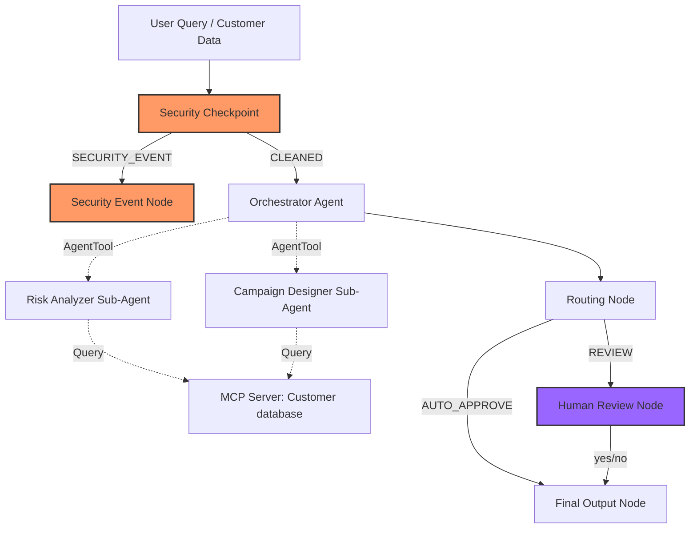

# ZeroChurn Predictor — Submission Write-Up

## Problem Statement
In modern SaaS and subscription businesses, customer success teams are overwhelmed by data. Siloed customer interactions—scattered across support ticket queues, system login logs, and billing logs—make it extremely difficult to identify customer churn risks before it is too late. Customer success managers need an intelligent, automated assistant that can proactively combine these data streams, evaluate churn risks accurately, design personalized retention campaigns (with incentives), and flag sensitive cases for human review before sending outreach.

## Solution Architecture

## Concepts Used

1. **ADK Workflow (Graph-based API)**: Implemented in [agent.py](file:///c:/Users/sneha/Documents/AI-Agents/adk-workspace/zerochurn-predictor/app/agent.py#L199-L215). Coordinates the processing pipeline starting from the security check to orchestration, routing, human approval, and final outputs.
2. **LlmAgent**: Used for the orchestrator and sub-agents in [agent.py](file:///c:/Users/sneha/Documents/AI-Agents/adk-workspace/zerochurn-predictor/app/agent.py#L39-L97) to enable semantic reasoning, structured analysis, and custom content generation.
3. **AgentTool**: Declared and wired in [agent.py](file:///c:/Users/sneha/Documents/AI-Agents/adk-workspace/zerochurn-predictor/app/agent.py#L88) to delegate complex analyzer and campaign generation tasks from the orchestrator to specialized sub-agents.
4. **MCP Server**: Designed in [mcp_server.py](file:///c:/Users/sneha/Documents/AI-Agents/adk-workspace/zerochurn-predictor/app/mcp_server.py) using the Model Context Protocol SDK to expose database access functions to the sub-agents.
5. **Security Checkpoint**: Implemented in [agent.py](file:///c:/Users/sneha/Documents/AI-Agents/adk-workspace/zerochurn-predictor/app/agent.py#L111-L183) as a safety gateway to filter prompt injection attempts, scrub PII, validate query structures, and generate structured audit logs.
6. **Agents CLI**: Used to scaffold the project structure (`agents-cli scaffold create`), install dependencies, and run the developer playground for manual verification.

## Security Design

- **PII Scrubbing**: Using regular expressions, the security checkpoint detects and masks credit cards, phone numbers, and email addresses in customer ticket text to protect customer privacy and comply with regulations (e.g., GDPR/CCPA).
- **Prompt Injection Filter**: Scans user input for adversarial override instructions (e.g., "ignore previous instructions") to prevent prompt hacking, system instructions leak, or hijacking of the workflow.
- **Structured Audit Logging**: Prints structured JSON audit payloads (detailing event, severity, decisions, and checks triggered) to the server logs for real-time monitoring and threat logging.
- **Domain-Specific Query Guard**: Validates that all customer ID mentions follow the strict format `cust_[a-zA-Z0-9_-]+` to prevent SQL/NoSQL injection or unauthorized database probing.

## MCP Server Design

Implemented in [mcp_server.py](file:///c:/Users/sneha/Documents/AI-Agents/adk-workspace/zerochurn-predictor/app/mcp_server.py) using `FastMCP` over stdio transport:
- `get_customer_usage_data(customer_id)`: Exposes login frequency, adoption rates, and active usage hours.
- `get_customer_support_tickets(customer_id)`: Returns ticket logs containing Priority, Subject, Status, and Sentiments.
- `get_customer_subscription_details(customer_id)`: Exposes subscription tiers, billing logs, and payment failures.

## Human-in-the-Loop (HITL) Flow

Implemented in the `human_review_node` in [agent.py](file:///c:/Users/sneha/Documents/AI-Agents/adk-workspace/zerochurn-predictor/app/agent.py#L145-L161):
- **Why**: Automated email outreach to high-risk customers or customers expressing cancellation requests can backfire if the tone is wrong or the discount offered is inappropriate.
- **How**: The orchestrator checks if `needs_human_review` is true. If yes, it routes to `human_review_node`, which yields a `RequestInput` pausing the graph. The agent resumes only when the user reviews and submits approval (yes/no) in the playground UI.

## Demo Walkthrough

1. **Test Case 1 (Low Risk)**: Under query `cust_101`, the system returns low risk, drafts a generic check-in outreach, and outputs it automatically.
2. **Test Case 2 (High Risk & HITL)**: Querying `cust_102` outputs a high-risk rating due to an 80% usage drop. The Campaign Designer drafts an email offering API support and billing credits. The workflow pauses in the UI to ask the user: "Do you approve this draft? (yes/no):". Entering "yes" finishes and tags the email draft as `[APPROVED]`.
3. **Test Case 3 (Security Block)**: Sending prompt injection or bad customer ID formats (e.g., `cust_101; DROP TABLE`) triggers the security checkpoint block, outputting a blocked response message and raising a `CRITICAL` severity audit log.

## Impact / Value Statement

ZeroChurn Predictor turns customer support and usage data into proactive retention.
- **For CSM Teams**: Saves hours spent manually investigating user usage trends across multiple dashboards and drafting custom templates.
- **For the Business**: Directly mitigates revenue churn by automatically surfacing high-risk accounts and drafting high-conversion retention campaigns, while ensuring compliance and safety through the security gate and human-in-the-loop approvals.
